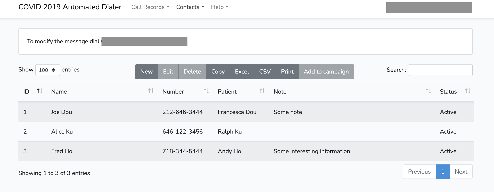
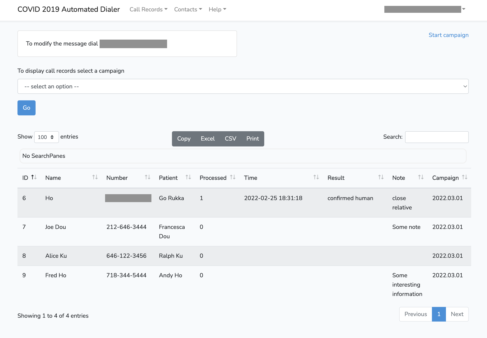

# Automated Dialing System (open source) - ADSos
[]
[](http://doge.mit-license.org)
[](https://github.com/xyrk/covid2019/actions/workflows/ci.yaml)
<!-- [] -->
[](https://goreportcard.com/report/github.com/xyrk/covid2019)
<a href="https://packagist.org/packages/laravel/browser-kit-testing"></a>

This software originally was created to inform multiple users over the phone about some event and collect simple data, like confirmation, via DTMF tones.
It could be used for weather events, informational ads and so on. The systems like this also is known as "school dialing system".
The list of contacts could be uploaded from csv file and edited withing the system if necessary. It is possible to create different campaigns and track the results withing each campaign.   
The system can detect answering machine and is based on open source software "asterisk".

## Description and architecture
The system was designed to run on aws EC2 instance and consists of next components:
- EC2 instance (Ubuntu 20.04.4 LTS) - runs core voip engine (asterisk 18), frontend (Laravel), backend (goland)
- asterisk PBX (runs on EC2)
- frontend GUI (runs on EC2 - Laravel) 
- backend for GUI (runs on EC2 - Golang)
- MariaDB - used for frontend authentication and stores information about contacts, campaigns and calls.


<details><summary>Screenshots</summary>

Contacts view:

  
Calls view:

  
</details> 

### Site of the project:
[https://adsos.us](http://adsos.us)

---
## Installation

### **DISCLAIMER!!!**  
*Voice over IP (a technology, which is a part of this stack) is an area which involves many fraudulent schemas. Multiple bots are constantly scanning internet and searching for unprotected SIP servers. It is absolutely necessary to make sure that this instance is throughfully protected and SIP traffic is allowed ONLY from trusted servers, like Amazon Chime or your SIP provider. During the cloudformation stack creation you will be asked for SIP signalling and media IP addresses. By default there Chime IP addresses are set. NEVER set this value to 0.0.0.0 even for testing. The server could easily be hacked withing hours and you may end up with 4-5 figures bill from your SIP provider just in one night.*


There are 2 options on how to install: via cloudformation or codedeploy.
### Installation via cloudformation script
1. Create a stack from cloudformation script (cloudformation-template.yml). It will create all necessary components, except Amazon Chime. You should have a configured Chime account (or any other SIP provider account)
2. Update Origination/Termination IP address in Chime's settings. IP address can be found in the "Outputs" section " of cloudformation (InstanceIPAddress).You need origination (incoming calls) to be able to record a greeting which will be played by the dialer. The original text see below in the "Misc information". If you do not want to make recording over the phone you may skip origination setup.
3. After installation is complete you need to login on EC2 instance and enable user registration. Run the next commands to login to the instance:
```
ssh -p 22 ubuntu@EC2ADDRESS -i ~/.ssh/AWS-key.pem
sudo /var/www/html/covid2019-auto-dialer-front/enable_registration.sh on 
```
5. Login to http://INSTANCE_IP_ADDRESS/register and QUICKLY register a new user.
6. IMPORTANT: run next command to disable registration. Otherwise, anybody will be able to register. By default, there are no restrictions for registration, but it is disabled by default. If you plan to keep it open - make sure that only trusted IP addresses can reach the instance ports tcp 80 and 443 
```
sudo /var/www/html/covid2019-auto-dialer-front/enable_registration.sh off
```
7. The system is ready. Read "Help->Help" or instructions below to learn how to use the system.

### Installation via cloudformation script
Not deployed in public repo yet.


## Local development (frontend)  
To run frontend in docker for local development run frontend/scripts/run-dev-env.sh

## Misc information
---

### covid_recorded_human.wav
Hello. This is a test message from the automatic dialing system. Press "one" to confirm this message or "two" to listen it again. Thank you.


### Help
To start a dialing campaign you need to create it first (Call Records -> Campaigns).
Then you need to copy contacts to this campaign. Go to Contacts->Contacts, select required contacts (use SHIFT+mouse_click to select multiple contacts) and press the button "Add to campaign". Select desired campaign. To start campaign go to Call Records->Call Records. Select a campaign. The records for this campaign should be displayed. In the upper right corner select "Start campaign". Withing 1 minute the system should start dialing numbers. After the campaign is finished you should receive an email and records in database should update. Note, that email just a notification and contains just basic information about records. Use web interface to get all records from the campaign.
It is enough to import Contacts only once (Contacts -> Load Contacts). You can just paste CSV data directly into the web form. Another option to add contacts - to use the button "New" on the "Contacts -> Contacts" page. Also, you can edit/delete existing contacts. Select a contact by mouse click and use Edit/Delete buttons. You can also do mass edit for multiple contacts (use SHIFT+mouse_click to select more than one contact)


### cli utils for sound conversion to asterisk compatible format
afconvert -d LEI16 -f 'WAVE' covid_recorded_human_backup.mp3 covid_recorded_human_backup.wav
sox covid_recorded_human_backup.wav -r 8000 -c1 covid_recorded_human_backup_8000.wav


### TODO specific
- [x] sort desc by id campaigns in frontend
- [x] remove role "removeme"
- [x] add role for EC2 to use SES and fix cloudformation -         - CodeDeploy-EC2-Instance-Profile
- [x] add HELP description for structure of covid_recorded_human_backup.wav
- [x] test on clean aws account (IAM existing roles check)
- [x] screenshots
- [x] config_campaign_generator_template
- [x] covidcampaigngenerator.php
- [x] check that useddata .evn variables survive instance reboot. Move .env to ec2 tags  
- [x] add to cloudformation-template ami from all US regions. Currently, the static ami-0892d3c7ee96c0bf7 is set for us-west-2 only
- [x] update Contact email in help
- [x] add releases to github
- [x] remove default values from cloudformation template. Update PhoneNumber and SIPHost.
- [ ] update git clone ${!REPO_ADDRESS} covid in user-data in ec2. Remove authorization.
- [x] register domain and site for documentation
- [ ] create description for Chime
- [ ] github badges


- [ ] asterisk in docker on fargate - release 2.0.0
- [ ] laravel in docker - release 3.0.0
- [ ] improve cf-template for better support sip media and sip signalling IP addresses. Should allow multiple CIDRs via csv. List<Strings>  1.1.1.0/24,2.2.2.2/24  etc ...

- [ ] festival
- [-] set rules in iptables
- [-] add SSL for Frontend
- [-] installation via code deploy pipeline. Create codedeploy pipeline template for cloudformation
- [-] embed install_4_cloudformation.sh into cloudformation-template.yml

### TODO general
- [ ] Integrate with Amazon Polly
- [ ] Add sms/email notifications
- [ ] create Chime config in CloudFormation 

### Bugs
- [ ] refresh the page after a contact is created manually (not via "load contacts). If the page is not refreshed an attempt to add new contact to the campaign returns "added 0 contacts"